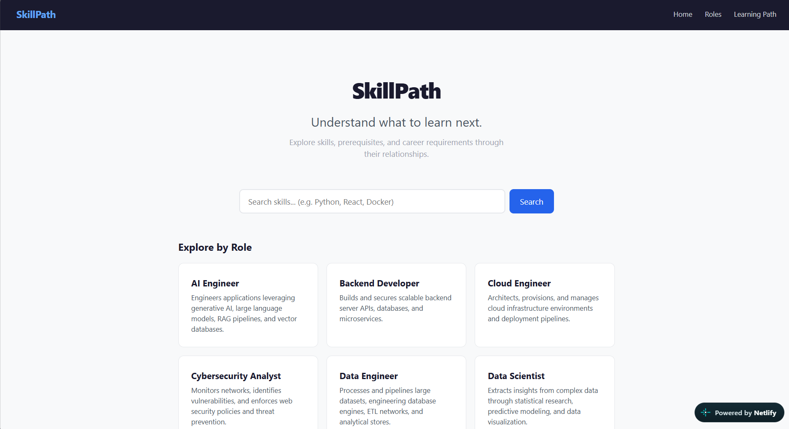
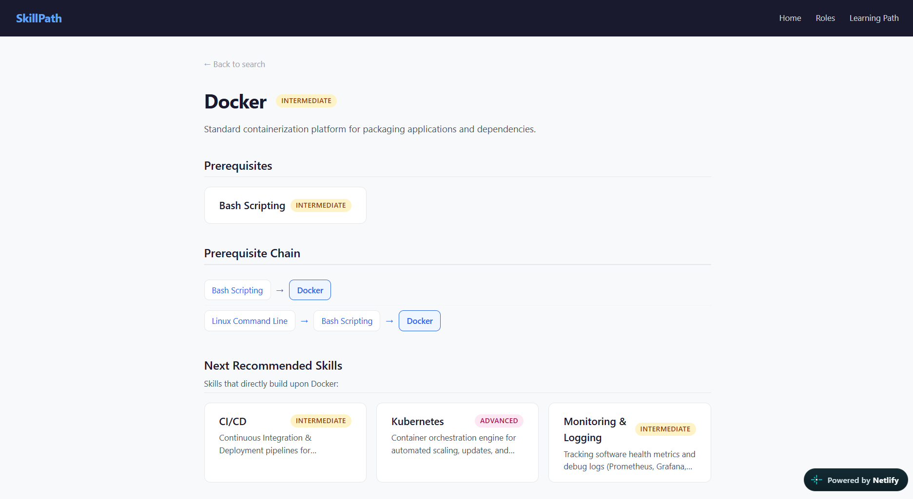
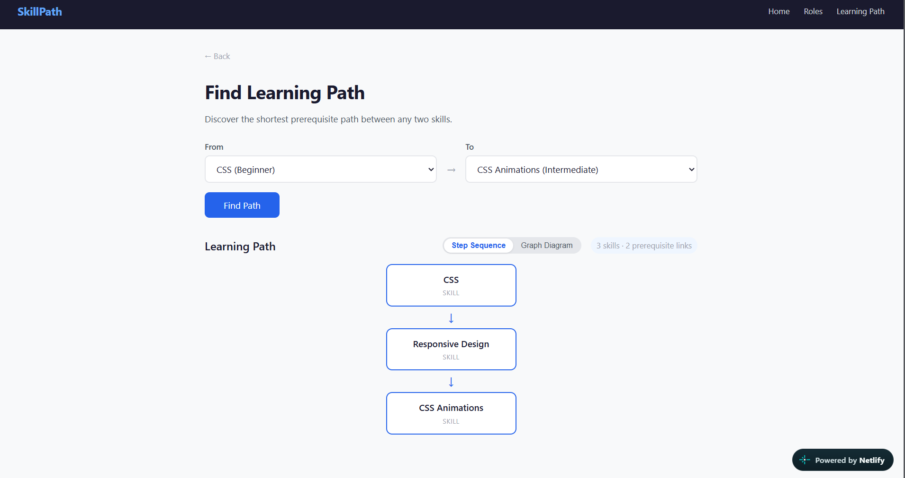
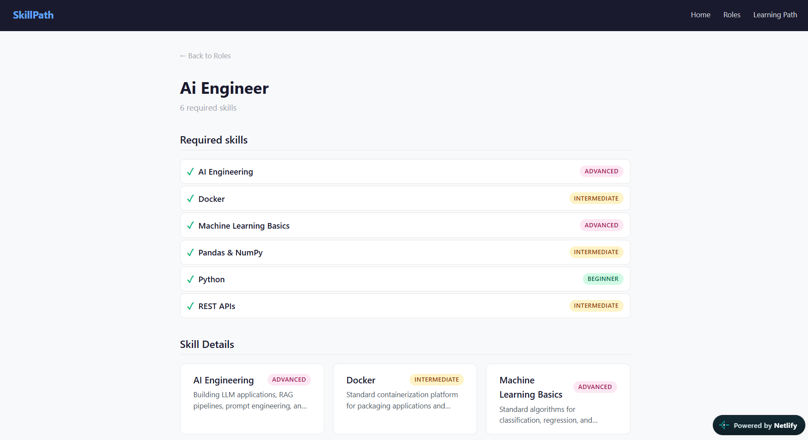
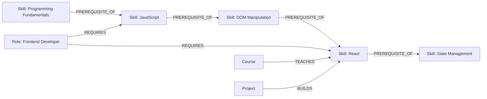

# SkillPath

SkillPath is a graph-driven career learning path explorer built with CognoDB Cloud.

It helps users answer a simple question:

> **"What should I learn before I learn this, and where can it lead me?"**

Instead of treating skills as isolated records, SkillPath models the relationships between skills, career roles, courses, and projects. This allows users to explore prerequisite chains, discover related skills, understand career requirements, and find learning paths between technologies.

---

## 🌐 Live Demo

**Application:** https://skillpath-demo.netlify.app/  
**Backend API:** https://skillpath-api-o1bl.onrender.com/

The frontend is hosted on Netlify and communicates with the FastAPI backend hosted on Render. The backend connects to CognoDB Cloud for graph storage.

The backend health endpoint can be used to verify live database connectivity:  
`GET /api/health` $\rightarrow$ `{"status": "healthy", "database": "connected"}`

---

## 🎥 Demo Video

A short screen recording demonstrating the SkillPath application, including skill search, prerequisite exploration, learning-path discovery, graph visualization, and career-role exploration.

[Watch the SkillPath Demo](https://drive.google.com/file/d/1wiNbRB9UA4K5Zsf76z9mLwjcAfCbPFlE/view?usp=sharing)

---

## 💡 Why SkillPath?

Learning a technical skill is rarely an isolated process. Skills depend on other skills, career roles require combinations of skills, and courses and projects provide different ways to build those skills.

SkillPath models these connections explicitly so users can explore not only **what to learn**, but also **what comes before it, where it leads, and how it connects to a career goal**.

The project was designed specifically around these relationships, making a graph database a natural fit for the problem.

---

## 🛠️ Technology Stack

| Layer | Technology |
|---|---|
| Frontend | React 18, Vite, React Router |
| Backend | FastAPI, Python 3.10+ |
| Graph Database | CognoDB Cloud |
| Database Driver | Neo4j Python Driver (shared application driver) |
| Query Language | openCypher |
| Deployment | Netlify (Frontend) + Render (Backend) |

---

## ✨ Features

- **Skill Search**: Case-insensitive search across technical skills.
- **Skill Details & Prerequisite Exploration**: Detailed skill profiles with direct prerequisites, courses, projects, and career role usage.
- **Multi-Hop Prerequisite Traversal**: Automated discovery of multi-level prerequisite dependency chains up to depth 5.
- **Related Skill Exploration**: Discovery of complementary and alternative technologies.
- **Next-Skill Recommendations**: Graph-derived recommendations for logical next learning steps.
- **Career Role Explorer**: Detailed career role requirements and skill checklists.
- **Role Prerequisite Graphs**: Complete prerequisite graph visualization for all skills required by a role.
- **Shortest Learning-Path Discovery**: Graph pathfinding between any two skills with node sequence and step metrics.
- **Interactive SVG Graph Visualization**: Node-edge graph rendering as a progressive enhancement.
- **Unified UX States**: Loading spinners, consistent error messages, 404 views, and empty state feedback.
- **Responsive Layout**: Designed for Desktop, Tablet (768px), and Mobile (480px) viewports with zero horizontal overflow.
- **Graph Semantic Validation**: Automated validation for schema constraints, cycle detection, orphan detection, duplicate edges, and reachability.
- **Graceful Failure Handling**: Clean API error handling without exposing database tracebacks or raw 500 exceptions.

---

## 🖥️ UI Screenshots

### Home — Skill Search

The SkillPath home page provides skill search, popular career roles, and direct access to the learning-path explorer.



### Skill Details & Prerequisites

The skill details page combines prerequisite exploration, career-role usage, courses, projects, and next recommended skills.



### Learning Path Explorer

The learning-path explorer calculates the shortest prerequisite path between two skills and provides both a step sequence and interactive graph visualization.



### Career Role Explorer

The role explorer shows the core skills required for a career role and the prerequisite dependencies behind those requirements.



---

## 🏗️ Architecture

```text
React 18 + Vite (http://localhost:5174)
      ↓ REST API Calls (services/api.js)
FastAPI REST API (http://127.0.0.1:8000/api)
      ↓ Service Layer (skill_service, role_service, path_service)
Repository Layer (graph_repository.py)
      ↓ Parameterized Cypher Queries
Neo4j Python Driver (shared application driver)
      ↓
CognoDB Cloud (Graph Storage)
```

- **Separation of Concerns**: Thin HTTP route layer $\rightarrow$ Domain service layer $\rightarrow$ Repository layer with parameterized Cypher queries $\rightarrow$ CognoDB.
- **Progressive Enhancement**: Standard HTML/text accessibility for skills, roles, and paths, complemented by interactive SVG `GraphVisualization` diagrams.
- **Graceful Error Handling**: Global 500 exception handler masks raw database tracebacks and returns clean JSON error responses.

---

## 📊 Graph Model

### Why a Graph Database?

The core questions in SkillPath are relationship-driven:

- What skills are prerequisites for this skill?
- What skills does a career role require?
- What is the learning path between two skills?
- Which courses and projects are connected to a skill?
- What skills become reachable after learning a particular skill?

These relationships form a connected dependency graph. In a relational design, multi-hop prerequisite queries would typically require joins and recursive CTEs. In CognoDB, they can be expressed directly as graph traversals using Cypher.

For SkillPath, the graph is therefore not just a storage choice—it is the basis of the application's core functionality.

---

### Node Types
- `Skill`: `id`, `name`, `description`, `level` (`Beginner`, `Intermediate`, `Advanced`)
- `Role`: `id`, `name`, `description`
- `Course`: `id`, `name`, `description`
- `Project`: `id`, `name`, `description`

### Relationship Types
- `PREREQUISITE_OF`: `(a:Skill)-[:PREREQUISITE_OF]->(b:Skill)`
- `REQUIRES`: `(r:Role)-[:REQUIRES]->(s:Skill)`
- `TEACHES`: `(c:Course)-[:TEACHES]->(s:Skill)`
- `BUILDS`: `(p:Project)-[:BUILDS]->(s:Skill)`
- `RELATED_TO`: `(a:Skill)-[:RELATED_TO]-(b:Skill)`

### Relationship Semantics
- `PREREQUISITE_OF`: Strict ordered learning dependency (*Skill A must be learned before Skill B*).
- `REQUIRES`: A career role requires mastery of a skill.
- `TEACHES`: A course provides structured educational instruction for a skill.
- `BUILDS`: A project offers practical hands-on application demonstrating a skill.
- `RELATED_TO`: Complementary or alternative skills without prerequisite ordering.

---

### Graph Model Diagram



**Core Graph Pattern:**
```text
Skill  ──PREREQUISITE_OF──→ Skill
Role   ──REQUIRES─────────→ Skill
Course ──TEACHES─────────→ Skill
Project──BUILDS──────────→ Skill
Skill  ──RELATED_TO──────── Skill
```

---

## 📈 Current Graph Statistics

| Entity / Relationship | Count |
|---|---:|
| Skills | 73 |
| Roles | 14 |
| Courses | 20 |
| Projects | 15 |
| PREREQUISITE_OF | 62 |
| REQUIRES | 90 |
| TEACHES | 43 |
| BUILDS | 41 |
| RELATED_TO | 13 |

The graph is validated using `backend/scripts/verify_graph.py`, enforcing relationship schema rules, prerequisite cycle detection (0 cycles), self-reference detection (0 loops), orphan detection (0 orphans), duplicate-edge detection (0 duplicates), and role prerequisite reachability.

---

## 🔌 API Endpoints

### Health
- `GET /api/health`: System health status & CognoDB database connectivity (`200 OK` or `503 Service Unavailable`).

### Skills
- `GET /api/skills`: List all skills in the graph.
- `GET /api/skills/search?q={query}`: Case-insensitive skill-name search.
- `GET /api/skills/{id}`: Skill details, direct prerequisites, related skills, courses, projects, and role applications.
- `GET /api/skills/{id}/prerequisites`: Direct prerequisites and prerequisite-chain information.
- `GET /api/skills/{id}/chain`: Multi-hop prerequisite chains up to depth 5.
- `GET /api/skills/{id}/related`: Related / complementary skills.
- `GET /api/skills/{id}/next`: Next recommended skills that build directly upon this skill.

### Roles
- `GET /api/roles`: List all career roles.
- `GET /api/roles/{id}`: Role details and required core skills checklist.
- `GET /api/roles/{id}/graph`: Prerequisite graph chains required for a role's core skills.

### Paths
- `GET /api/paths?from={source_id}&to={target_id}`: Shortest prerequisite path, node sequence, directed edges, and graph depth metrics.

---

## 🔍 Key Graph Queries

### Multi-Hop Prerequisite Traversal
The prerequisite query traverses the `PREREQUISITE_OF` relationship across multiple hops to discover the dependency chain required to reach a skill.

Example:
```text
Programming Fundamentals → JavaScript → DOM Manipulation → React
```
This is implemented using variable-length Cypher traversal (`-[:PREREQUISITE_OF*1..5]->`) rather than manually joining relational tables.

### Shortest Learning Path
The learning-path query finds the shortest directed prerequisite path between two skills (`shortestPath((start)-[:PREREQUISITE_OF*1..10]->(target))`).

For example:
```text
Programming Fundamentals → JavaScript → DOM Manipulation → React
```
The API returns the ordered nodes, relationships, and path depth metrics (`4 skills · 3 prerequisite links`).

### Role Prerequisite Graph
For a career role, SkillPath first identifies its required skills through `REQUIRES` relationships and then traverses their prerequisite chains (`(r:Role)-[:REQUIRES]->(req:Skill)<-[:PREREQUISITE_OF*0..5]-(prereq)`).

This exposes dependencies that are several relationships away from the role itself.

### Related Skills
`RELATED_TO` relationships allow the application to discover complementary or alternative technologies (`(s:Skill)-[:RELATED_TO]-(other:Skill)`) without treating them as strict prerequisites.

### Why these queries benefit from a graph
These queries depend on following relationships across multiple hops. In a relational schema, the same operations would require combinations of JOINs and recursive queries. In SkillPath, the relationships are directly represented as graph edges and traversed using Cypher.

---

## 🔎 Example User Flow

A user can:
1. Search for `Python`.
2. Open the **Python** skill detail page (`/skills/python`).
3. View `Programming Fundamentals` as its direct prerequisite.
4. Explore career roles requiring Python (e.g. **Backend Developer**, **Machine Learning Engineer**).
5. Navigate to **Learning Path** (`/paths`) and select `Programming Fundamentals` $\rightarrow$ `React`.
6. View the calculated shortest learning path:
   ```text
   Programming Fundamentals → JavaScript → DOM Manipulation → React
   (4 skills · 3 prerequisite links)
   ```
7. Toggle to **Graph Diagram** view to interact with the visual node-edge diagram.

---

## 🚀 Local Setup

### Prerequisites
- Python 3.10+
- Node.js 18+
- Active CognoDB Cloud instance

### Environment Configuration
Create a `.env` file in the project root directory:

```ini
COGNODB_URI=bolt+s://db-xxxxxxxx.bravo.databases.cognodb.com
COGNODB_USERNAME=cognodb
COGNODB_PASSWORD=your_secure_password_here

API_HOST=127.0.0.1
API_PORT=8000
```

---

## 🗄️ Database Setup & Seeding

### 1. Test Connection
```bash
.\venv\Scripts\python backend/test_connection.py
```

### 2. Reset Database (Wipe Graph)
```bash
.\venv\Scripts\python backend/scripts/reset_database.py
```

### 3. Seed Dataset
```bash
.\venv\Scripts\python backend/scripts/seed.py
```

### 4. Run Automated Graph Validation
```bash
.\venv\Scripts\python backend/scripts/verify_graph.py
```

---

## 💻 Running the Application

### 1. Start Backend FastAPI Server
```bash
.\venv\Scripts\python -m uvicorn backend.app.main:app --reload
```
Backend runs at `http://127.0.0.1:8000`. Swagger API docs are available at `http://127.0.0.1:8000/docs`.

### 2. Start Frontend Vite Dev Server
```bash
cd frontend
npm run dev
```
Frontend runs at `http://localhost:5174`.

---

## 🧪 Testing

Run the complete 17-point automated API behavior and end-to-end user journey test suite:
```bash
.\venv\Scripts\python scratch/test_phase29_phase30.py
```

---

## 📂 Project Structure

```text
SkillPath/
├── .env.example
├── .gitignore
├── README.md
├── requirements.txt
├── backend/
│   ├── app/
│   │   ├── main.py
│   │   ├── config.py
│   │   ├── db/
│   │   │   └── driver.py
│   │   ├── repositories/
│   │   │   └── graph_repository.py
│   │   ├── services/
│   │   │   ├── skill_service.py
│   │   │   ├── role_service.py
│   │   │   └── path_service.py
│   │   └── routes/
│   │       ├── health.py
│   │       ├── skills.py
│   │       ├── roles.py
│   │       └── paths.py
│   ├── scripts/
│   │   ├── seed.py
│   │   ├── reset_database.py
│   │   └── verify_graph.py
│   └── test_connection.py
├── cypher/
│   ├── schema.cypher
│   ├── search_skills.cypher
│   ├── skill_details.cypher
│   ├── prerequisites.cypher
│   ├── multi_hop_prereq.cypher
│   ├── learning_path.cypher
│   ├── role_requirements.cypher
│   ├── role_skills.cypher
│   ├── related_skills.cypher
│   └── next_skills.cypher
├── screenshots/
│   ├── home.png
│   ├── skill-details.png
│   ├── learning-path.png
│   └── role-explorer.png
└── frontend/
    ├── index.html
    ├── package.json
    ├── vite.config.js
    ├── public/
    │   └── _redirects
    └── src/
        ├── main.jsx
        ├── App.jsx
        ├── App.css
        ├── services/
        │   └── api.js
        ├── components/
        │   ├── SearchBar.jsx
        │   ├── SkillCard.jsx
        │   ├── SkillGraph.jsx
        │   ├── PathView.jsx
        │   ├── GraphVisualization.jsx
        │   ├── LoadingState.jsx
        │   └── ErrorState.jsx
        └── pages/
            ├── Home.jsx
            ├── SkillDetails.jsx
            ├── RolesList.jsx
            ├── RoleDetails.jsx
            └── LearningPath.jsx
```

---

## 🔐 Security

- CognoDB credentials are loaded strictly from environment variables.
- `.env` is excluded from version control via `.gitignore`.
- `.env.example` contains placeholders only.
- No database credentials are committed to the repository.

To verify that `.env` is excluded from version control:
```bash
git check-ignore .env
# Expected output: .env
```

---

## ✅ Verification

The final integration test suite passes completely:
- Graph semantic validation: **0 errors**
- Integration / E2E test suite: **17/17 passed**
- Database failure handling: **passed** (`HTTP 503` returned gracefully)
- Database recovery: **passed** (`HTTP 200` restored gracefully)
- Frontend user journeys: **passed**

---

## 📌 Project Status

The assignment implementation is complete and the current version is the final submission build.

The application, graph dataset, validation suite, deployment, documentation, and demo have been verified end-to-end.
